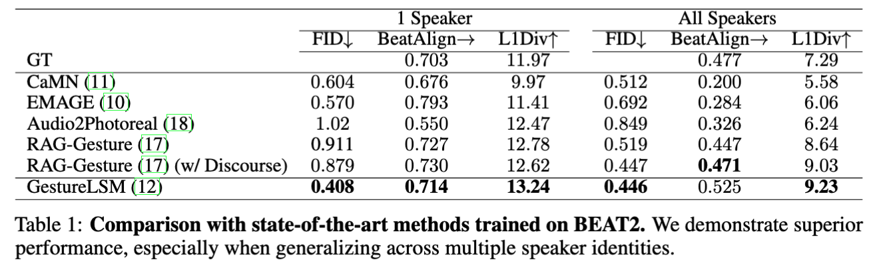

[](https://paperswithcode.com/sota/gesture-generation-on-beat2?p=gesturelsm-latent-shortcut-based-co-speech) <a href="https://arxiv.org/abs/2501.18898"></a>


# GestureLSM: Latent Shortcut based Co-Speech Gesture Generation with Spatial-Temporal Modeling [ICCV 2025]


# 📝 Release Plans

- [x] Inference Code
- [x] Pretrained Models
- [x] A web demo
- [x] Training Code
- [x] Clean Code to make it look nicer
- [x] Support for [MeanFlow](https://arxiv.org/abs/2505.13447)
- [x] Unified training and testing pipeline
- [ ] MeanFlow Training Code (Coming Soon)
- [ ] Merge with [Intentional-Gesture](https://github.com/andypinxinliu/Intentional-Gesture)

## 🔄 Code Updates

**Latest Update**: The codebase has been cleaned and restructured. For legacy or historical information, please check out the `old` branch.

**New Features**:
- Added MeanFlow model support
- Unified training and testing pipeline using `train.py`
- New configuration files in `configs_new/` directory
- Updated checkpoint files with improved performance

# ⚒️ Installation

## Build Environtment

```
conda create -n gesturelsm python=3.12
conda activate gesturelsm
conda install pytorch==2.1.2 torchvision==0.16.2 torchaudio==2.1.2 pytorch-cuda=11.8 -c pytorch -c nvidia
pip install -r requirements.txt
bash demo/install_mfa.sh
```

## 📁 Code Structure

Understanding the codebase structure will help you navigate and customize the project effectively.

```
GestureLSM/
├── 📁 configs_new/              # New unified configuration files
│   ├── diffusion_rvqvae_128.yaml    # Diffusion model config
│   ├── shortcut_rvqvae_128.yaml     # Shortcut model config
│   └── meanflow_rvqvae_128.yaml     # MeanFlow model config
├── 📁 configs/                  # Legacy configuration files (deprecated)
├── 📁 ckpt/                     # Pretrained model checkpoints
│   ├── new_540_diffusion.bin        # Diffusion model weights
│   ├── shortcut_reflow.bin          # Shortcut model weights
│   ├── meanflow.pth                 # MeanFlow model weights
│   └── net_300000_*.pth            # RVQ-VAE model weights
├── 📁 models/                   # Model implementations
│   ├── Diffusion.py                 # Diffusion model
│   ├── LSM.py                       # Latent Shortcut Model
│   ├── MeanFlow.py                  # MeanFlow model
│   ├── 📁 layers/                   # Neural network layers
│   ├── 📁 vq/                       # Vector quantization modules
│   └── 📁 utils/                    # Model utilities
├── 📁 dataloaders/              # Data loading and preprocessing
│   ├── beat_sep_lower.py            # Main dataset loader
│   ├── 📁 pymo/                     # Motion processing library
│   └── 📁 utils/                    # Data utilities
├── 📁 trainer/                  # Training framework
│   ├── base_trainer.py              # Base trainer class
│   └── generative_trainer.py        # Generative model trainer
├── 📁 utils/                    # General utilities
│   ├── config.py                    # Configuration management
│   ├── metric.py                    # Evaluation metrics
│   └── rotation_conversions.py      # Rotation utilities
├── 📁 demo/                     # Demo and visualization
│   ├── examples/                    # Sample audio files
│   └── install_mfa.sh               # MFA installation script
├── 📁 datasets/                 # Dataset storage
│   ├── BEAT_SMPL/                   # Original BEAT dataset
│   ├── beat_cache/                  # Preprocessed cache
│   └── hub/                         # SMPL models and pretrained weights
├── 📁 outputs/                  # Training outputs and logs
│   └── weights/                     # Saved model weights
├── train.py                     # Unified training/testing script
├── demo.py                      # Web demo script
├── rvq_beatx_train.py          # RVQ-VAE training script
└── requirements.txt             # Python dependencies
```

### 🔧 Key Components

#### **Model Architecture**
- **`models/Diffusion.py`**: Denoising diffusion model for high-quality generation
- **`models/LSM.py`**: Latent Shortcut Model for fast inference
- **`models/MeanFlow.py`**: Flow-based model for single-step generation
- **`models/vq/`**: Vector quantization modules for latent space compression

#### **Configuration System**
- **`configs_new/`**: New unified configuration files for all models
- **`configs/`**: Legacy configuration files (deprecated)
- Each config file contains model parameters, training settings, and data paths

#### **Data Pipeline**
- **`dataloaders/beat_sep_lower.py`**: Main dataset loader for BEAT dataset
- **`dataloaders/pymo/`**: Motion processing library for gesture data
- **`datasets/beat_cache/`**: Preprocessed data cache for faster loading

#### **Training Framework**
- **`train.py`**: Unified script for training and testing all models
- **`trainer/`**: Training framework with base and generative trainers
- **`optimizers/`**: Optimizer and scheduler implementations

#### **Utilities**
- **`utils/config.py`**: Configuration management and validation
- **`utils/metric.py`**: Evaluation metrics (FGD, etc.)
- **`utils/rotation_conversions.py`**: 3D rotation utilities

### 🚀 Getting Started with the Code

1. **For Training**: Use `train.py` with configs from `configs_new/`
2. **For Inference**: Use `demo.py` for web interface or `train.py --mode test`
3. **For Customization**: Modify config files in `configs_new/` directory
4. **For New Models**: Add model implementation in `models/` directory

## Results



This table shows the results of 1-speaker and all-speaker comparisons. RAG-Gesture refers to [**Retrieving Semantics from the Deep: an RAG Solution for Gesture Synthesis**](https://arxiv.org/abs/2412.06786), accepted by CVPR 2025. The stats for 1-speaker is based on speaker-id of 2, 'scott' in order to be consistent with the previous SOTA methods. I directly copied the stats from the RAG-Gesture repo, which is different from the stats in the current paper. 

## Important Notes

### Model Performance
- The statistics reported in the paper is based on 1-speaker with speaker-id of 2, 'scott' in order to be consistent with the previous SOTA methods.
- The pretrained models are trained on 1-speaker. (RVQ-VAEs, Diffusion, Shortcut, MeanFlow)
- If you want to use all-speaker, please modify the config files to include all speaker ids.
- April 16, 2025: updated the pretrained model to include all speakers. (RVQ-VAEs, Shortcut)
- No hyperparameter tuning was done for all-speaker - same settings as 1-speaker are used.

### Model Design Choices
- No speaker embedding is included to make the model capable of generating gestures for novel speakers.
- No gesture type information is used in the current version. This is intentional as gesture types are typically unknown for novel speakers and settings, making this approach more realistic for real-world applications.
- If you want to see better FGD scores, you can try adding gesture type information.

### Code Structure
- **Current Version**: Clean, unified codebase with MeanFlow support
- **Legacy Code**: Available in the `old` branch for historical reference
- **Accepted to ICCV 2025** - Thanks to all co-authors!


## Download Models

### Pretrained Models (Updated)
```
# Option 1: From Google Drive
# Download the pretrained models (Diffusion + Shortcut + MeanFlow + RVQ-VAEs)
gdown https://drive.google.com/drive/folders/1OfYWWJbaXal6q7LttQlYKWAy0KTwkPRw?usp=drive_link -O ./ckpt --folder

# Option 2: From Huggingface Hub
huggingface-cli download https://huggingface.co/pliu23/GestureLSM --local-dir ./ckpt

# Download the SMPL model
gdown https://drive.google.com/drive/folders/1MCks7CMNBtAzU2XihYezNmiGT_6pWex8?usp=drive_link -O ./datasets/hub --folder
```

### Available Checkpoints
- **Diffusion Model**: `ckpt/new_540_diffusion.bin`
- **Shortcut Model**: `ckpt/shortcut_reflow.bin` 
- **MeanFlow Model**: `ckpt/meanflow.pth`
- **RVQ-VAE Models**: `ckpt/net_300000_upper.pth`, `ckpt/net_300000_hands.pth`, `ckpt/net_300000_lower.pth`

## Download Dataset
> For evaluation and training, not necessary for running a web demo or inference.

### Download BEAT2 Dataset from Hugging Face
The original dataset download method is no longer available. Please use the Hugging Face dataset:

```bash
# Download BEAT2 dataset from Hugging Face
huggingface-cli download H-Liu1997/BEAT2 --local-dir ./datasets/BEAT2
```

**Dataset Information**:
- **Source**: [H-Liu1997/BEAT2 on Hugging Face](https://huggingface.co/datasets/H-Liu1997/BEAT2)
- **Size**: ~4.1K samples
- **Format**: CSV with train/test splits
- **License**: Apache 2.0

### Legacy Download (Deprecated)
> The original download method is no longer working
```bash
# This command is deprecated and no longer works
# bash preprocess/bash_raw_cospeech_download.sh
```

## Testing/Evaluation

> **Note**: Requires dataset download for evaluation. For inference only, see the Demo section below.

### Unified Testing Pipeline

The codebase now uses a unified `train.py` script for both training and testing. Use the `--mode test` flag for evaluation:

```bash
# Test Diffusion Model (20 steps)
python train.py --config configs_new/diffusion_rvqvae_128.yaml --ckpt ckpt/new_540_diffusion.bin --mode test

# Test Shortcut Model (2-step reflow)
python train.py --config configs_new/shortcut_rvqvae_128.yaml --ckpt ckpt/shortcut_reflow.bin --mode test

# Test MeanFlow Model (1-step flow-based)
python train.py --config configs_new/meanflow_rvqvae_128.yaml --ckpt ckpt/meanflow.pth --mode test
```

### Model Comparison

| Model | Steps | Description | Key Features | Use Case |
|-------|-------|-------------|--------------|----------|
| **Diffusion** | 20 | Denoising diffusion model | High quality, slower inference | High-quality generation |
| **Shortcut** | 2-4 | Latent shortcut with reflow | Fast inference, good quality | **Recommended for most users** |
| **MeanFlow** | 1 | Flow-based generation | Fastest inference, single step | Real-time applications |

### Performance Comparison

| Model | Steps | FGD Score ↓ | Beat Constancy ↑ | L1Div Score ↓ | Inference Speed |
|-------|-------|-------------|------------------|---------------|-----------------|
| **MeanFlow** | 1 | **0.4031** | **0.7489** | 12.4631 | **Fastest** |
| **Diffusion** | 20 | 0.4100 | 0.7384 | 12.5752 | Slowest |
| **Shortcut** | 20 | 0.4040 | 0.7144 | 13.4874 | Fast |
| **Shortcut-ReFlow** | 2 | 0.4104 | 0.7182 | **13.678** | Fast |

**Legend**: 
- **FGD Score** (↓): Lower is better - measures gesture quality
- **Beat Constancy** (↑): Higher is better - measures audio-gesture synchronization  
- **L1Div Score** (↑): Higher is better - measures diversity of generated gestures

**Recommendation**: **MeanFlow** is the clear winner, offering the best FGD and L1Div scores with the fastest inference speed.

### Legacy Testing (Deprecated)
> For reference only - use the unified pipeline above instead
```bash
# Old testing commands (deprecated)
python test.py -c configs/shortcut_rvqvae_128.yaml
python test.py -c configs/shortcut_reflow_test.yaml  
python test.py -c configs/diffuser_rvqvae_128.yaml
```

## Train RVQ-VAEs (1-speaker)
> Require download dataset 
```
bash train_rvq.sh
```

## Training

> **Note**: Requires dataset download for training.

### Unified Training Pipeline

The codebase now uses a unified `train.py` script for training all models. Use the new configuration files in `configs_new/`:

```bash
# Train Diffusion Model
python train.py --config configs_new/diffusion_rvqvae_128.yaml

# Train Shortcut Model  
python train.py --config configs_new/shortcut_rvqvae_128.yaml

# Train MeanFlow Model
python train.py --config configs_new/meanflow_rvqvae_128.yaml
```

### Training Configuration

- **Config Directory**: Use `configs_new/` for the latest configurations
- **Output Directory**: Models are saved to `./outputs/weights/`
- **Logging**: Supports Weights & Biases integration (configure in config files)
- **GPU Support**: Configure GPU usage in the config files

### Legacy Training (Deprecated)
> For reference only - use the unified pipeline above instead
```bash
# Old training commands (deprecated)
python train.py -c configs/shortcut_rvqvae_128.yaml
python train.py -c configs/diffuser_rvqvae_128.yaml
```


## Quick Start

### Demo/Inference (No Dataset Required)
```bash
# Run the web demo with Shortcut model
python demo.py -c configs/shortcut_rvqvae_128_hf.yaml
```

### Testing with Your Own Data
```bash
# Test with your own audio and text (requires pretrained models)
python train.py --config configs_new/shortcut_rvqvae_128.yaml --ckpt ckpt/shortcut_reflow.bin --mode test
```

## Demo

The demo provides a web interface for gesture generation. It uses the Shortcut model by default for fast inference.

```bash
python demo.py -c configs/shortcut_rvqvae_128_hf.yaml
```

**Features**:
- Web-based interface for easy interaction
- Real-time gesture generation
- Support for custom audio and text input
- Visualization of generated gestures


# 🙏 Acknowledgments
Thanks to [SynTalker](https://github.com/RobinWitch/SynTalker/tree/main), [EMAGE](https://github.com/PantoMatrix/PantoMatrix/tree/main/scripts/EMAGE_2024), [DiffuseStyleGesture](https://github.com/YoungSeng/DiffuseStyleGesture), our code is partially borrowing from them. Please check these useful repos.


# 📖 Citation

If you find our code or paper helps, please consider citing:

```bibtex
@inproceedings{liu2025gesturelsmlatentshortcutbased,
  title={{GestureLSM: Latent Shortcut based Co-Speech Gesture Generation with Spatial-Temporal Modeling}},
  author={Pinxin Liu and Luchuan Song and Junhua Huang and Chenliang Xu},
  booktitle={IEEE/CVF International Conference on Computer Vision},
  year={2025},
}
```
